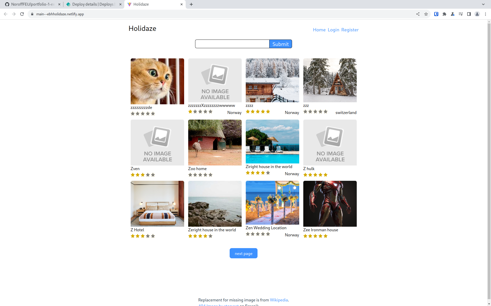

[](https://app.netlify.com/sites/ebhholidaze/deploys)

# [Project exam 2: Holidaze](https://github.com/Eirik-Haukeland/ProjectExam2)



This is my exam project for Noroff front end course. is uses [Noroff's holidaze api](https://docs.noroff.dev/docs/v1/holidaze/authentication) to simulate a hotel booking site. [The site is live on Netlify](https://main--ebhholidaze.netlify.app/)

[Link to design](https://www.figma.com/file/FUWQP6EOiVvfkLZZhc8pMj/Untitled?type=design&node-id=2-25&mode=design&t=owE8poJBZz6Kd3l2-0)

## Contributing

To work on this pojec, you need [git](https://git-scm.com/) and [npm](https://docs.npmjs.com/downloading-and-installing-node-js-and-npm).

After you have git and npm, run this on your local device to download this porject to your local computer:
``` shell
git clone https://github.com/Eirik-Haukeland/ProjectExam2
```

Then navigate to the folder and run the following to get a development enviorment:
``` shell
npm run dev
```

Netlify will build on depolyment but you can run the following to build locally:
```shell
npm run build
```

If you want to run a linter, this is available with this command:
```shell
npm run lint
```

